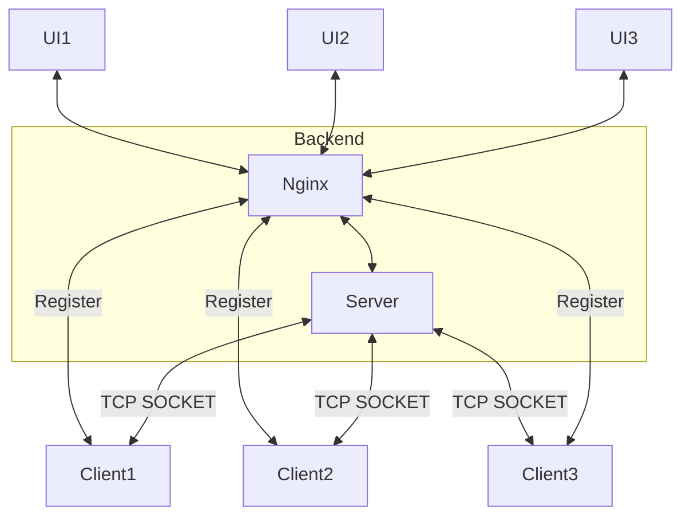
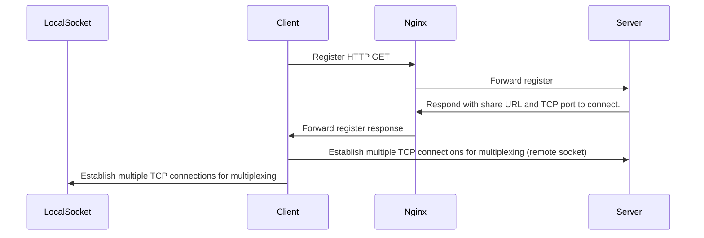
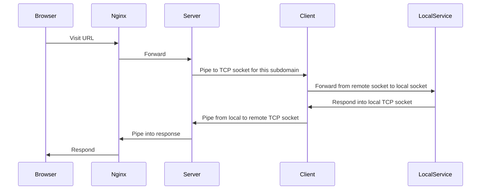
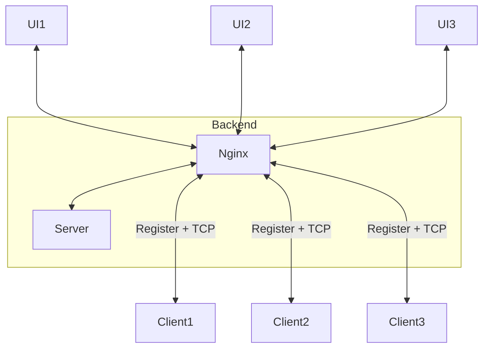

# localtunnel-server

Fork of <https://github.com/localtunnel/server> with E2E encryption.

## Architecture

Used terms:

* UI - Browser connection to e.g. <https://my-app.example.com>.
* Nginx - Reverse proxy server - <https://www.nginx.com/>.
* Server - forked [Localtunnel server](https://github.com/localtunnel/server). Written in NodeJS.



### Client registration low



* Client sends an HTTP GET request to Nginx, which forwards it to the server.
* The server starts a TCP server on a free port and sends the port number in response along with a generated share URL.
* Client creates `max_conn_count` number of threads to allow multiplexing. Each thread creates 2 TCP connections (tunnels).
  * Local socket - connection to locally running service that the user wants to expose.
  * Remote socket - connection to the remote server (TLS encrypted).

### URL connection flow



* Share URL points to Nginx which appends proxy headers and forwards all requests to the Localtunnel server.
* Based on the subdomain provided, the server streams the requests into an open TCP connection and waits for the data.
* Data flow: Browser -> Nginx -> Server -> Client -> local socket -> Client -> Server -> Nginx -> Browser.

### Future improvements

The biggest problem the current architecture has is the need for opening all TCP connections, which might pose a security risk. The ideal architecture would only expose 3 ports:

* HTTPS `:443`.
* HTTP `:80`.
* TCP connection `:TCP_SERVER_PORT`.

This would allow for all traffic to flow through the Nginx, making up for simpler horizontal scaling and better security.



## Deployment

The easiest way to deploy is to use a provided `docker-compose` file, but since both images (`nginx.dockerfile` and `server.dockerfile`) are super simple, it's not that much work to come up with a custom deployment.

Currently deployable on Linux only due to `docker` supporting `network_mode: host` on Linux only. Running on different OS would require forwarding every single port of `server.dockerfile`.

### Requirements

* Docker compose - <https://docs.docker.com/compose/>
* All TCP ports open for now (unfortunately). See the [Future improvements](#future-improvements) section on what is needed to mitigate this.
* Valid TLS/SSL certificate within `ssl` folder. Needs to contain `server.crt` and `server.key` files (hardcoded within docker images currently).
* Enough file descriptors available for the server process. Each client makes 10 TCP connections by default (can be configured via `max-sockets` server param) which translates to 10 file descriptors.

Once all the requirements have been met:

```sh
docker-compose up
```

### System Limits

Each server node is limited by:

* Number of server ports - ~64k if we omit port numbers < 1000 which tend to have special meaning.
* Number of server file descriptors (FD) - if we were to support 64k concurrent clients (^^), each connecting with 10 TCP sockets, a total of 640k FDs would be needed (which is slightly beyond the hard limit for most Linux machines anyway). Note that it's necessary to explicitly configure the FD limit for the server process.
* RAM - Limits the amount of data that can flow through the system at a given time. Impossible to estimate since the system supports arbitrarily-sized data.

### Sharing limits

As previously mentioned, each client opens 10 TCP connections by default. 1 connection needs to be reserved for a persistent Websocket (WS) connection (case of [Wave](https://wave.h2o.ai/) and [Nitro](https://nitro.h2o.ai/)). Assume your app is running at `https://my-app.h2oai.app`.

* Browser tab 1 connects to the URL - 1 persistent connection. Total client connections left - 9.
* Browser tab 2 connects to the URL - 1 persistent connection. Total client connections left - 8.
* And so on.

This means the share URL can only be opened in 10 browser tabs at most. An ideal case is 2 - 3 max. If sharing among more people is needed, [H2O AI Cloud](https://h2oai.github.io/h2o-ai-cloud/) or any other hosting solution should be used instead.

### Load balancing

TBD.

### Optimal network latency

TBD.
